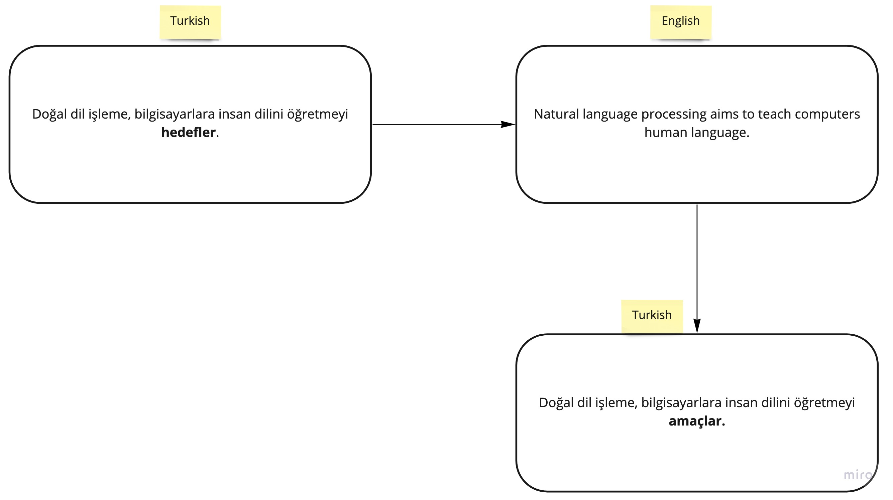

# Data Augmentation for NLP
*Data augmentation* is a very popular method in *computer vision* but they can be useful when your data is *text*. This repo contains implementation of data augmentation techniques on *Turkish* language. 


### Data Augmentation Techniques

1. **Back Translation** :traffic_light:

   Translate the text to another language and then translate it back to your language. This may generate text data with different words without changing the meaning of the sentence.

   

   Google-translate, yandex etc. can be used here. --> Web scraping.

   

2. **Easy Data Augmentation (EDA)** :tractor:

   EDA is a simple and traditional method for data augmentation. Consist of 4 operations.

   

   - **Synonym Replacement**

     Select a word that is not a stop words and replace it its synonym.

     > Doğal Dil İşleme insanların kendi aralarında anlaşmak için kullandıkları **dili** insan-bilgisayar etkileşimini en üst düzeye çıkarabilmek için çözümler üreten bilim **dalıdır**.

     > Doğal Dil İşleme insanların kendi aralarında anlaşmak için kullandıkları **lisanı** insan-bilgisayar etkileşimini en üst düzeye çıkarabilmek için çözümler üreten bilim **alanıdır**.

     

   - **Random Insertion**

     Find a random synonym of a random **n** words in text date and insert into a random place.

     > **Daha önce** bu durumla karşılaşmıştım.
     
     > Bu durumla **geçmişte** karşılaşmıştım.

     
     
   - **Random Swap**

     Randomly select **n** words in the text and swap the positions.

     > **Oktay** okulun basketbol takımındaki öğrencilerinden biriydi.
     
     > Okulun basketbol takımındaki öğrencilerinden biriydi **Oktay**.

     
     
   - **Random Deletion**

     Randomly select **n** words and remove them.

     > Doğal Dil İşleme insanların **kendi aralarında** anlaşmak için kullandıkları dili insan-bilgisayar etkileşimini **en** üst düzeye çıkarabilmek için çözümler üreten bilim dalıdır.
     
     > Doğal Dil İşleme insanların anlaşmak için kullandıkları dili insan-bilgisayar etkileşimini üst düzeye çıkarabilmek için çözümler üreten bilim dalıdır.

3. **NLP Albumentation** :camera:

   If the given text contains multiple sentences then just shuffle them.

   Text:

   ```
   Beynimden vurulmuşçasına yerimden fırladım. Gözlerimi ovuşturdum iyice. Her yanı gözden geçirdim. Karşımda beni ciddi ciddi süzen, küçük, eşi görülmedik biri duruyordu.
   ```

   Augmented text:

   ```
   Karşımda beni ciddi ciddi süzen, küçük, eşi görülmedik biri duruyordu. Gözlerimi ovuşturdum iyice. Her yanı gözden geçirdim. Beynimden vurulmuşçasına yerimden fırladım.
   ```

4. **NLP Aug Library** :books:

   NLPAug is a library that helps you to implement all the data augmentation methods above on your projects. 


### References

- https://neptune.ai/blog/data-augmentation-nlp
- https://towardsdatascience.com/data-augmentation-in-nlp-2801a34dfc28
- https://github.com/makcedward/nlpaug
